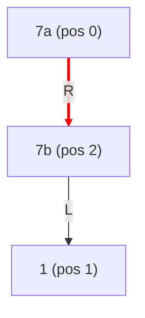
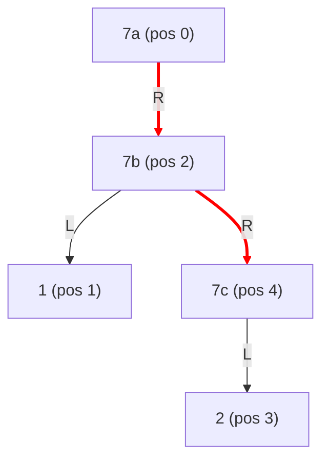
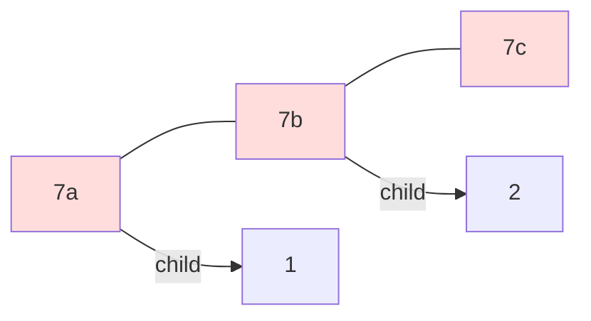

# LeetCode 1340. Jump Game V

題目係[呢度](https://leetcode.com/problems/jump-game-v/)

俾你一個 array `arr` 同一個 integer `d`。你企喺 index `i`，可以跳去 index `j`，條件係：`|i-j| <= d`，`arr[i] > arr[j]`（strict），而且中間所有 element 都 strictly less than `arr[i]`。問由任何位置出發，最多可以 visit 幾多個 index。

## 想法

呢題個 key insight 係 Cartesian tree。

如果我 build 一個 max Cartesian tree（parent 一定 >= children），咁 post-order traversal 就俾咗一個 topological ordering — children 一定先於 parent 被 process。因為 children 嘅值一定 <= parent，即係 children 係 parent 可以跳去嘅候選人。

所以 DP 好自然：

$$
\text{answer}[p] = 1 + \max(\text{answer}[\text{valid children}])
$$

Valid children 就係 subtree 入面、距離 $\le d$ 嘅 positions。用 segment tree 做 range max query，每個 node 嘅 DP 就係 $O(\log n)$。

成個 algorithm 係 $O(n \log n)$，獨立於 $d$。

## Subtree 入面有 equal value 嘅問題

但有一個 subtle 嘅問題：standard Cartesian tree 入面，subtree 可以包含同 root 一樣大嘅 element。

考慮 `[7, 1, 7]`。建 max Cartesian tree（用 `<` 做 pop 條件），第一個 7 做 root，第二個 7 喺佢嘅 right subtree：



7a 嘅 subtree 包含 7b，但 Jump Game V 要求 **strict** inequality — 你唔可以跳去同值嘅 position。如果 naively 用 subtree range 做 query range，就會錯咗 include 7b。

## Trimming — clip at equal-valued direct child

解決方法出奇地簡單：**如果 direct child 同自己 value 一樣，就 clip 到嗰個 child 嘅 position**。

```python
if node.right and node.right.value == node.value:
    right_clip = node.right.pos - 1
if node.left and node.left.value == node.value:
    left_clip = node.left.pos + 1
```

對於 `[7, 1, 7]`：7a 嘅 right child 係 7b (value = 7 = 7a)，所以 clip right boundary 到 position 1。7a 嘅 effective range 就只係 `[0, 1]`，正確地排除咗 position 2。

### 點解 trimming 一定 correct？

因為我哋 build Cartesian tree 嘅 pop condition 係 strict `<`：相等嘅值唔會 pop。呢個 choice 意味住：

- 後出現嘅 equal value 唔會 pop 前面嘅 → 後者一定係前者嘅 descendant
- 具體嚟講，後者一定落入前者嘅 **right subtree**（因為佢 positionally 喺右邊）
- 而且一定係 **direct right child**（或者 direct right child chain 嘅一部分）

即係話：same-value elements 嘅 link 總係 **lean right**（後者做前者嘅 right descendant），而且 chain 上面冇其他同值或更大嘅 node 阻隔。所以只要 clip at direct child，就一定 correct。

同理，如果有 `[7, 1, 7, 2, 7]`，Cartesian tree 會形成一條 right chain `7a → 7b → 7c`，每個 clip at next 嘅 position，每個 effective range 都唔會 overlap 到 sibling。



每個 node 嘅 effective range（clip 之後）：
- 7a: `[0, 1]`（clip at 7b pos 2）
- 7b: `[1, 3]`（clip at 7c pos 4）
- 7c: `[3, 4]`（冇 red edge，用 full subtree）

## Bushy Tree 嘅 Isomorphism

呢個 trimming 其實有一個好 clean 嘅 structural interpretation：佢 recover 緊一棵 **bushy tree**。

喺 bushy tree 入面，same-value nodes 唔係 ancestor-descendant，而係 **siblings**：



個 isomorphism 其實好簡單：如果一條 parent-child edge 連接住 **same value** 嘅 nodes，我哋 color 佢做 **red**。由我哋嘅 construction（strict `<` pop），red edges 一定指向右邊。

要由 binary tree 恢復 bushy tree，只需要將 red edges 由 vertical 變成 **horizontal** — 即係將 parent-child 關係變成 sibling 關係。就係咁簡單。

```
Binary Tree:                    Bushy Tree (orient red edges horizontal):

    7a                              7a ─── 7b ─── 7c
     \  ← red                       |       |
      7b                            1       2
     / \  ← red
    1   7c
        /
       2
```

留意我哋唔需要引入 virtual root：如果 root 本身有 red edges 出去，佢自然就係 bushy tree 嗰排 siblings 嘅 leftmost member。

Trimming at direct child 嘅意義就係：唔好跨過 red edge — 因為 red edge 另一邊係 sibling，唔係 descendant。

## 解法

```py
from typing import List


class CartesianNode:
    __slots__ = ['pos', 'value', 'left', 'right', 'start', 'end']

    def __init__(self, pos, value):
        self.pos = pos
        self.value = value
        self.left = None
        self.right = None
        self.start = pos
        self.end = pos + 1


def build_cartesian_tree(arr: List[int]) -> CartesianNode:
    """Build a max Cartesian tree. Pop when stack top value is strictly < current."""
    stack = []
    for i, val in enumerate(arr):
        node = CartesianNode(i, val)
        last_popped = None
        while stack and stack[-1].value < val:
            last_popped = stack.pop()
        if last_popped:
            node.left = last_popped
        if stack:
            stack[-1].right = node
        stack.append(node)

    root = stack[0]

    # Fix subtree ranges (iterative post-order)
    trav, cur, last = [], root, None
    while trav or cur:
        if cur:
            trav.append(cur)
            cur = cur.left
        else:
            peek = trav[-1]
            if peek.right and last != peek.right:
                cur = peek.right
            else:
                trav.pop()
                if peek.left:
                    peek.start = peek.left.start
                if peek.right:
                    peek.end = peek.right.end
                last = peek
                cur = None
    return root


class SegmentTree:
    def __init__(self, n):
        self.n = n
        self.tree = [0] * (2 * n)

    def update(self, i, val):
        i += self.n
        self.tree[i] = val
        while i > 1:
            i >>= 1
            self.tree[i] = max(self.tree[2 * i], self.tree[2 * i + 1])

    def query(self, l, r):
        if l > r:
            return 0
        res = 0
        l += self.n
        r += self.n + 1
        while l < r:
            if l & 1:
                res = max(res, self.tree[l])
                l += 1
            if r & 1:
                r -= 1
                res = max(res, self.tree[r])
            l >>= 1
            r >>= 1
        return res


class Solution:
    def maxJumps(self, arr: List[int], d: int) -> int:
        n = len(arr)
        if n <= 1:
            return n

        root = build_cartesian_tree(arr)
        seg = SegmentTree(n)
        answer = [0] * n

        # Iterative post-order traversal
        trav, cur, last = [], root, None
        while trav or cur:
            if cur:
                trav.append(cur)
                cur = cur.left
            else:
                peek = trav[-1]
                if peek.right and last != peek.right:
                    cur = peek.right
                else:
                    trav.pop()
                    node = peek
                    p = node.pos

                    # Clip at equal-valued direct children
                    left_clip = node.start
                    right_clip = node.end - 1
                    if node.left and node.left.value == node.value:
                        left_clip = node.left.pos + 1
                    if node.right and node.right.value == node.value:
                        right_clip = node.right.pos - 1

                    # Intersect with distance d
                    left_lo = max(left_clip, p - d)
                    left_hi = p - 1
                    right_lo = p + 1
                    right_hi = min(right_clip, p + d)

                    best = 0
                    if left_lo <= left_hi:
                        best = max(best, seg.query(left_lo, left_hi))
                    if right_lo <= right_hi:
                        best = max(best, seg.query(right_lo, right_hi))

                    answer[p] = 1 + best
                    seg.update(p, answer[p])

                    last = peek
                    cur = None

        return max(answer)
```

## 速度

$O(n \log n)$，獨立於 $d$。每個 position 只係做一次 segment tree query 同 update。

## Perplexity 嘅 cautionary tale

呢題我一開始用 Perplexity 幫手諗，但 repeatedly 搞唔掂 equal-value subtree 嘅 issue — 畀咗幾次 hint 都兜圈。呢個係一個提醒：當你見到一個 AI tool 明顯 repeatedly incapable of doing its job，唔好繼續糾纏，直接換 tool。Dwell on a broken tool 嘅 opportunity cost 遠大過 switch 嘅 cost。
